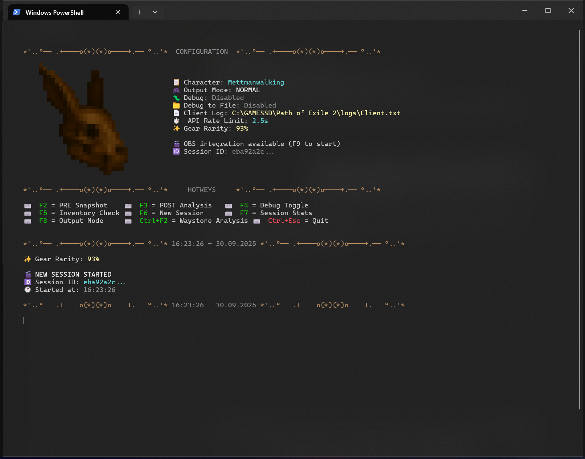
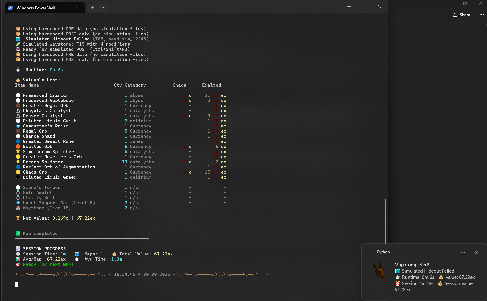
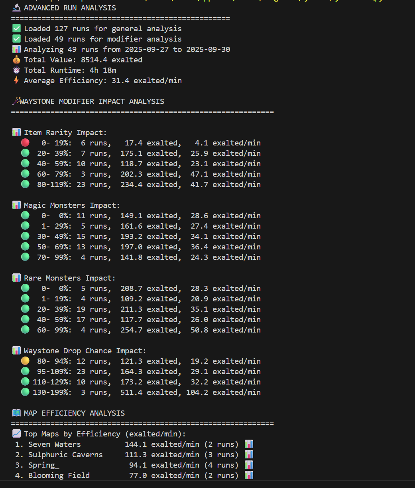
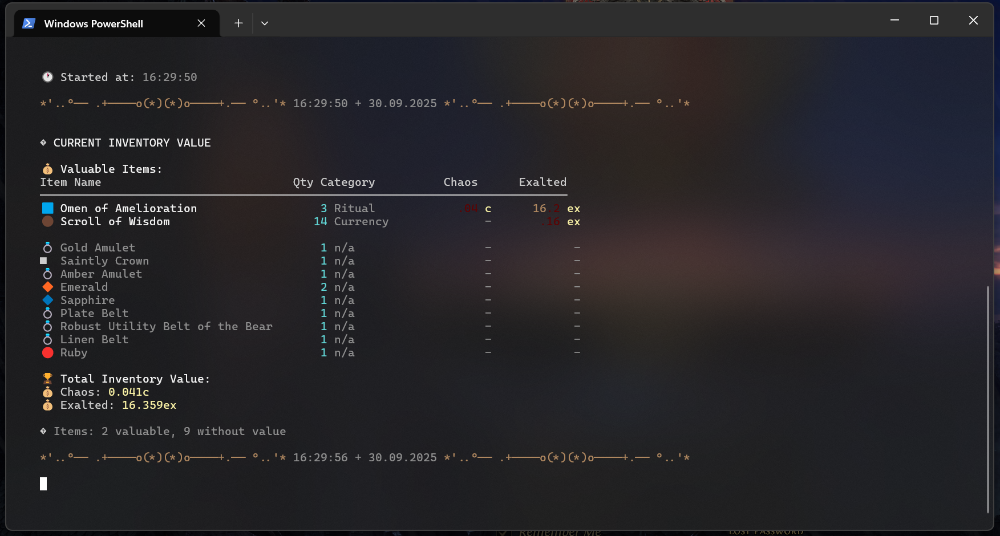
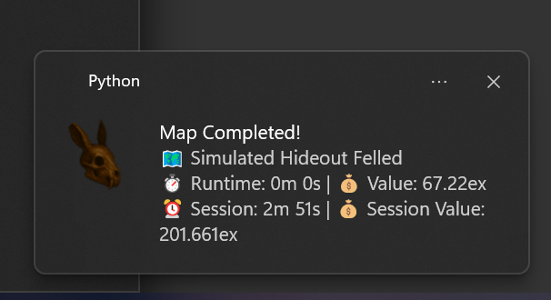
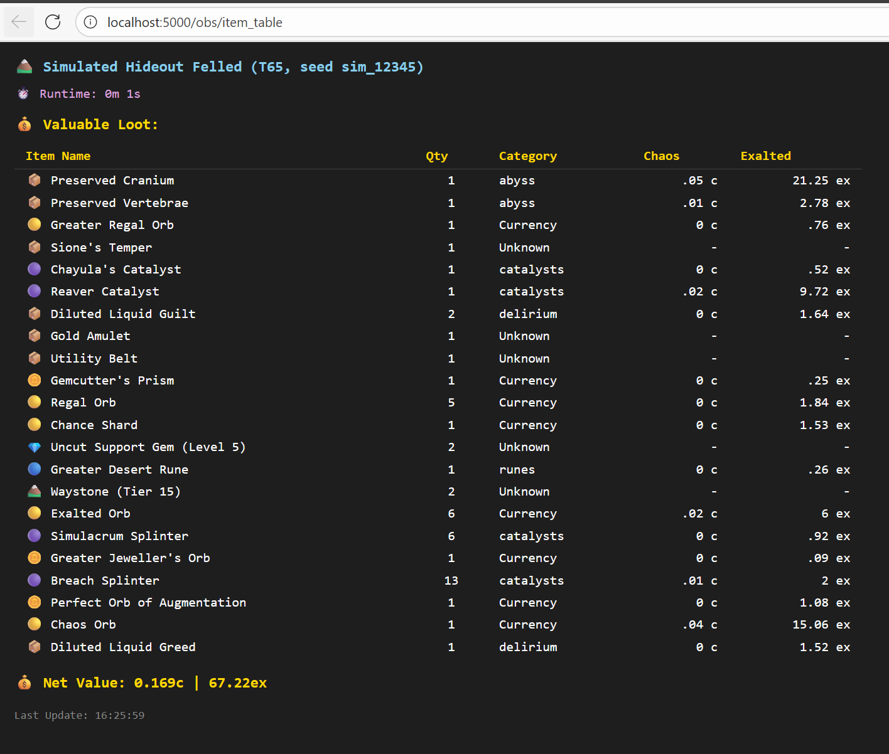
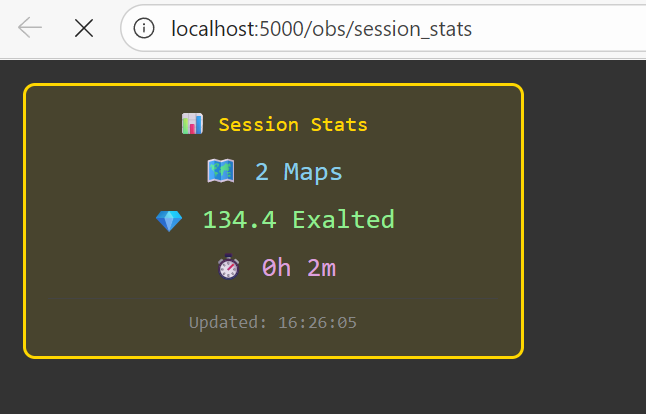

# DillaPoE2Stat 💎

> **Automatic loot tracking and session analytics for Path of Exile 2**

Track your farming sessions effortlessly with hotkeys, real-time loot valuation via poe.ninja, and rich analytics. Features automatic map detection, Windows notifications, and OBS overlay support for streamers.

<div align="center">
  
</div>

[](https://github.com/DoofDilla/dillapoe2stat/releases)
[](https://www.python.org/downloads/)
[](LICENSE)
[](https://github.com/DoofDilla/dillapoe2stat)

---

## 📑 Table of Contents

- [Why Use DillaPoE2Stat?](#-why-use-dillapoe2stat)
- [Key Features](#-key-features)
- [Quick Installation](#-quick-installation)
- [Usage Guide](#-usage-guide)
  - [Essential Hotkeys](#essential-hotkeys)
  - [Automatic Mode](#automatic-mode-)
- [Features Explained](#-features-explained)
- [Advanced Analysis Tools](#-advanced-analysis-tools)
- [Screenshots](#-screenshots)
- [Configuration](#-configuration)
- [Data & Logs](#-data--logs)
- [Troubleshooting](#-troubleshooting)
- [Advanced Topics](#️-advanced-topics)
- [Contributing](#-contributing)
- [Acknowledgements](#-acknowledgements)

---

## 🚀 Why Use DillaPoE2Stat?

- ⌨️ **Hotkey-Driven** - Start/stop tracking with F2/F3
- 🤖 **Auto-Detection** - Automatically tracks map transitions
- 💰 **Real-Time Valuation** - Instant loot pricing via poe.ninja
- 🔔 **Smart Notifications** - Windows toasts with top drops
- 📊 **Rich Analytics** - Track efficiency, best maps, Divine Orb patterns
- 📺 **OBS Ready** - Built-in overlays for streaming
- 🔐 **Secure** - Modern OAuth 2.1 authentication

## ✨ Key Features

### Core Tracking
- 📍 **Session-First Workflow** - Track entire farming sessions with runtime, loot summaries, and value trends
- 🎯 **Top Drops Analysis** - See your 3 most valuable items per map and across sessions
- 🏆 **Best Map Memory** - Automatically remembers your highest-value map with full stats
- 🌀 **Delirious % Tracking** - Automatic extraction from waystone suffixes

### Automation & Convenience
- 🤖 **Automatic Map Detection** - Background monitoring triggers snapshots as you zone
- 🔮 **Waystone Pre-Analysis** - Inspect waystones before running them
- 💰 **Price Intelligence** - Cached poe.ninja data for fast lookups
- 🔔 **Rich Notifications** - Template-based Windows toasts with formatted values

### Streaming & Display
- 📺 **OBS Overlays** - Flask server with Browser Source URLs for loot tables and session stats
- 🎨 **Customizable Themes** - ASCII footer themes and visual settings
- 💎 **HasiSkull Banner** - Colorful startup dashboard with config summary

### Data & Analysis
- 📊 **Efficiency Tiers** - Color-coded strategies and performance metrics
- 📈 **Run Analytics** - Divine Orb patterns, delirious correlations, and waystone strategies
- 💾 **Persistent Logging** - JSON Lines format for easy parsing and export
- 🔄 **Data Versioning** - Upgrade utilities for format migrations

---

## 📦 Quick Installation

### Prerequisites
- **Windows 10/11** (required for notifications and hotkeys)
- **Python 3.10+** ([Download here](https://www.python.org/downloads/))
- **Path of Exile 2** with access to `Client.txt` log file

### Installation Steps

**1. Download the Project**
```bash
git clone https://github.com/DoofDilla/dillapoe2stat.git
cd dillapoe2stat
```

Or [download the latest release](https://github.com/DoofDilla/dillapoe2stat/releases/latest) and extract it.

**2. Install Dependencies**
```bash
pip install -r requirements.txt
```

**3. Configure the Tracker**

Edit `config.py` and set:
```python
CHAR_TO_CHECK = "YourCharacterName"  # Your PoE2 character name
CLIENT_LOG = "C:\\Path\\To\\Client.txt"  # Path to your Client.txt log
```

**Default log location:**
```
C:\Users\YourName\Documents\My Games\Path of Exile 2\logs\Client.txt
```

**4. Run the Tracker**

```bash
python poe_stats_refactored_v2.py
```

**First Run:** Your browser will automatically open for OAuth 2.1 authorization. Just click "Authorize" and you're done! Tokens refresh automatically for 7 days.

---

## 🎮 Usage Guide

### Essential Hotkeys

| Key | Action |
|-----|--------|
| `F2` | **Start map tracking** - Capture pre-map inventory snapshot |
| `F3` | **End map tracking** - Capture post-map inventory, calculate loot value |
| `Ctrl+F6` | **Toggle auto-detection** - Let the tracker monitor Client.txt automatically |
| `F5` | **Check inventory value** - Quick snapshot of current stash value |
| `F7` | **Session dashboard** - View session stats and last 5 maps |

### Additional Hotkeys

| Key | Action |
|-----|--------|
| `Ctrl+F2` | Analyze waystone (inspect tier, mods, Delirious % before running) |
| `F4` | Toggle debug mode |
| `F6` | End current session and start new one |
| `F8` | Switch between normal and comprehensive output modes |
| `F9` | Toggle OBS overlay server |
| `Ctrl+Esc` | Exit the tracker |

### Automatic Mode 🤖

**The Best Way to Track!** Press `Ctrl+F6` to enable automatic map detection and never worry about hotkeys again.

**How It Works:**
1. You're in your hideout
2. Enter a waystone portal → **Auto F2** (pre-snapshot taken automatically)
3. Complete the map
4. Return to hideout → **Auto F3** (post-snapshot + loot calculation)
5. Repeat! The tracker handles everything.

**What Gets Tracked Automatically:**
- ✅ Hideout → Map transitions (triggers pre-snapshot)
- ✅ Map → Hideout returns (triggers post-snapshot)
- ✅ Respects Abyss/Breach detours (stays in map mode until you return home)
- ✅ Optional: Auto-analyzes waystones when passing through Well of Souls

**Configuration:**

Most hideouts are already configured! The tracker recognizes:
- All standard hideouts (Felled, Overgrown, Coral, Ritual)
- All town areas (Clearfell, Ogham, Nakuri Forest, Well of Souls)

**If your hideout isn't detected**, add it to `config.py`:

```python
# Near the bottom of config.py
AUTO_HIDEOUT_AREAS = {
    'HideoutFelled',       # Felled Hideout
    'HideoutOvergrown',    # Overgrown Hideout
    'HideoutCoral',        # Coral Hideout
    'HideoutRitual',       # Ritual Hideout
    'Hideout',             # Generic hideout
    # Add your hideout name here if needed
}

AUTO_TOWN_AREAS = {
    'Clearfell',           # Act 1 town
    'Ogham',               # Act 2 town
    'NakuriForest',        # Act 3 town
    'WellOfSouls',         # Well of Souls
    # Add custom safe zones here
}

AUTO_WAYSTONE_TRIGGER_AREAS = {
    'Abyss_Hub',           # Well of Souls - auto-analyzes waystones
}
```

**Finding Your Area Name:**
1. Enable debug mode (press `F4`)
2. Watch the console when entering your hideout
3. Look for the area name in the output (e.g., `"area": "HideoutFelled"`)
4. Add it to `AUTO_HIDEOUT_AREAS` in `config.py`

**Other Settings:**
```python
AUTO_DETECTION_ENABLED = False  # Or toggle with Ctrl+F6
AUTO_DETECTION_CHECK_INTERVAL = 1.0  # Check Client.txt every second
```

**Toggle Any Time:**
- `Ctrl+F6` - Turn auto-detection on/off
- Works even mid-session
- Status shown in startup banner

---

## 📊 Features Explained

### Loot Valuation
- Real-time pricing via **poe.ninja** API
- Supports: Currency, Catalysts, Waystones, Fragments, Runes, Gems
- Values shown in: Chaos Orbs, Exalted Orbs, Divine Orbs
- Smart caching for fast lookups

### Session Analytics
- **Efficiency tiers** - Color-coded performance metrics
- **Divine Orb patterns** - Track when and where they drop
- **Delirious correlation** - See which % yields best results
- **Strategy recommendations** - Based on your best maps

### Windows Notifications
Toast notifications for:
- Map start (session runtime, total value, ex/h)
- Map completion (map value, runtime, top 3 drops)
- Session milestones
- Waystone analysis results

Customize templates in `notification_templates.py` (40+ variables available)

### OBS Overlays for Streamers

1. Press `F9` to start the overlay server
2. Copy the URLs printed in the terminal:
   - `http://localhost:5000/obs/item_table` (600×400 recommended)
   - `http://localhost:5000/obs/session_stats` (300×200 recommended)
3. Add as **Browser Source** in OBS Studio
4. Enable "Refresh when scene becomes active"

Test overlays with simulation hotkeys: `Ctrl+Shift+F2` / `Ctrl+Shift+F3`

---

## 📈 Advanced Analysis Tools

After farming some maps, analyze your data to find the most profitable strategies!

### Run Analyzer - Deep Dive into Map Performance

**What it does:**
- Analyzes waystone modifier impact (item quantity, pack size, delirious %, etc.)
- Finds your most efficient maps
- Tracks Divine Orb drop patterns
- Recommends optimal farming strategies

**How to run:**

```bash
python run_analyzer.py
```

**What you'll see:**
- 📊 Waystone modifier impact analysis
- ⚡ Map efficiency rankings
- 💎 Divine Orb drop patterns
- 🎯 Optimal farming strategies

### Session Analyzer - Overall Performance Stats

**What it does:**
- Analyzes all your farming sessions
- Tracks value per hour across sessions
- Shows best sessions and character performance
- Provides long-term efficiency metrics

**How to run:**

```bash
python session_analyzer.py
```

**What you'll see:**
- 📊 Total sessions, maps, and value
- ⏱️ Average session runtime and efficiency
- 🏆 Best session by value
- 👤 Per-character statistics
- 🌟 Top 5 sessions ranked by value

### Customizing Currency Display

Both analyzers support **Exalted** or **Divine** Orb display.

**To change currency:**

Edit the analyzer file (right-click → Edit with Notepad):

**For Divine Orbs:**
```python
# In run_analyzer.py or session_analyzer.py
DEFAULT_CURRENCY_DISPLAY = "divine"  # Shows values in Divine Orbs
DEFAULT_DIVINE_TO_EXALTED_RATE = 400.0  # Current exchange rate
```

**For Exalted Orbs:**
```python
DEFAULT_CURRENCY_DISPLAY = "exalted"  # Shows values in Exalted Orbs
```

### Tips for Analysis

💡 **Run analyzers regularly** - After every 10-20 maps to spot trends  
💡 **Compare characters** - See which build farms more efficiently  
💡 **Track modifiers** - Learn which waystone mods give best returns  
💡 **Adjust strategy** - Focus on maps and modifiers that work best for you

---

## 📸 Screenshots

<details>
<summary>Click to view more screenshots</summary>

### Session Tracking & Analytics
<div align="center">
  
  <p><em>Map completion analysis with Windows toast notification</em></p>
</div>

<div align="center">
  
  <p><em>Session analytics with efficiency tiers and Divine Orb patterns</em></p>
</div>

### Inventory Valuation
<div align="center">
  
  <p><em>Real-time inventory valuation with item breakdown</em></p>
</div>

### Windows Notifications
<div align="center">
  
  <p><em>Native Windows 11 toast with formatted currency values</em></p>
</div>

### OBS Overlays
<div align="center">
  
  <p><em>OBS Browser Source overlay - Loot table</em></p>
</div>

<div align="center">
  
  <p><em>OBS Browser Source overlay - Session stats</em></p>
</div>

</details>

---

## 🔧 Configuration

### Essential Settings (`config.py`)

```python
# Character and log file
CHAR_TO_CHECK = "YourCharacterName"
CLIENT_LOG = "C:\\Path\\To\\Client.txt"

# Output preferences
OUTPUT_MODE = "normal"  # or "comprehensive"
DEBUG_ENABLED = False

# Notifications
NOTIFICATION_ENABLED = True

# OBS overlay server
OBS_ENABLED = False  # Set to True to auto-start with tracker
OBS_PORT = 5000

# Auto-detection
AUTO_DETECTION_ENABLED = False  # Toggle with Ctrl+F6 in-game
```

### ASCII Themes

Choose your footer theme by setting `ASCII_THEME` in `config.py`:
- `minimal` - Clean and simple
- `classic` - Traditional box style
- `double` - Double-line borders
- `rounded` - Smooth rounded corners

Edit `ascii_themes.json` to create custom themes.

---

## 📁 Data & Logs

### Generated Files
- **`runs.jsonl`** - Per-map records with loot, runtime, and valuations
- **`sessions.jsonl`** - Session summaries with best maps and top drops
- **`tokens.json`** - OAuth tokens (auto-generated, gitignored)
- **`debug/`** - Debug exports (when `DEBUG_TO_FILE = True`)

### Data Format
Current version: **2.1**
- Adds delirious % field
- Full per-item chaos/exalted/Divine valuations
- Upgrade old data with `upgrade_runs_data.py`

---

## ❓ Troubleshooting

### Common Issues

**Hotkeys don't work**
- Run terminal as Administrator
- Ensure no other app is capturing the same keys
- Check that `keyboard` package installed correctly

**Can't find Client.txt**
- Default location: `Documents\My Games\Path of Exile 2\logs\Client.txt`
- Update `CLIENT_LOG` in `config.py` with correct path
- Make sure the game has created the log file (run PoE2 first)

**No loot values showing**
- poe.ninja might be rate-limiting or lacking data
- Check your league setting in `price_check_poe2.py`
- Wait a few minutes and try again

**OAuth authorization fails**
- Browser opens automatically on first run
- Click "Authorize" when prompted
- Tokens refresh automatically for 7 days
- After 7 days, browser re-opens for re-authorization

**Toast notifications not appearing**
- Requires Windows 10/11
- Check notification settings in Windows
- Set `NOTIFICATION_ENABLED = False` in `config.py` to disable

---

## 🛠️ Advanced Topics

For technical details, architecture documentation, and extending the project, see:
- **[Technical Details](README-TECHNICAL.md)** - Architecture, modules, and internals
- **[Session Flow Documentation](docs/SESSION_FLOW.md)** - Phase-based flow diagrams
- **[CHANGELOG.md](CHANGELOG.md)** - Detailed version history
- **[Wiki](https://github.com/DoofDilla/dillapoe2stat/wiki)** - Full documentation

### Quick Links for Developers
- [Module Reference](README-TECHNICAL.md#repository-layout)
- [Extending the Project](README-TECHNICAL.md#extending-the-project)
- [Architecture Overview](README-TECHNICAL.md#architecture)
- [How Loot Valuation Works](README-TECHNICAL.md#how-loot-valuation-works)

---

## 🤝 Contributing

Contributions are welcome! Feel free to:
- 🐛 Report bugs via [GitHub Issues](https://github.com/DoofDilla/dillapoe2stat/issues)
- 💡 Suggest features or improvements
- 🔧 Submit pull requests
- 📝 Improve documentation

---

## 📄 License

This project is open source and available under the [MIT License](LICENSE).

---

## 🙏 Acknowledgements

- **Grinding Gear Games** for the Path of Exile API
- **poe.ninja** for economy data
- **PoE Community** for feedback and testing
- Built with ❤️ for Path of Exile 2 by [DoofDilla](https://github.com/DoofDilla)

---

## 📈 Version Info

**Current Version:** 0.4.0 "OAuth 2.1 Migration"  
**Data Format Version:** 2.1  
**Last Updated:** October 22, 2025

### What's New in v0.4.0
- 🔐 Modern OAuth 2.1 with browser-based authorization
- 🔄 Automatic token refresh (10h access, 7d refresh)
- 🎨 Lightweight KISS overlay system
- ✨ Full pricing for Uncut Gems
- 🔒 Secure token storage (no manual secrets)

[View Full Changelog](CHANGELOG.md)

---

<div align="center">
  <p>Made with 💎 for Path of Exile 2</p>
  <p>
    <a href="https://github.com/DoofDilla/dillapoe2stat">GitHub</a> •
    <a href="https://github.com/DoofDilla/dillapoe2stat/issues">Issues</a> •
    <a href="https://github.com/DoofDilla/dillapoe2stat/wiki">Wiki</a> •
    <a href="https://doofdilla.github.io/dillapoe2stat/">Website</a>
  </p>
</div>
